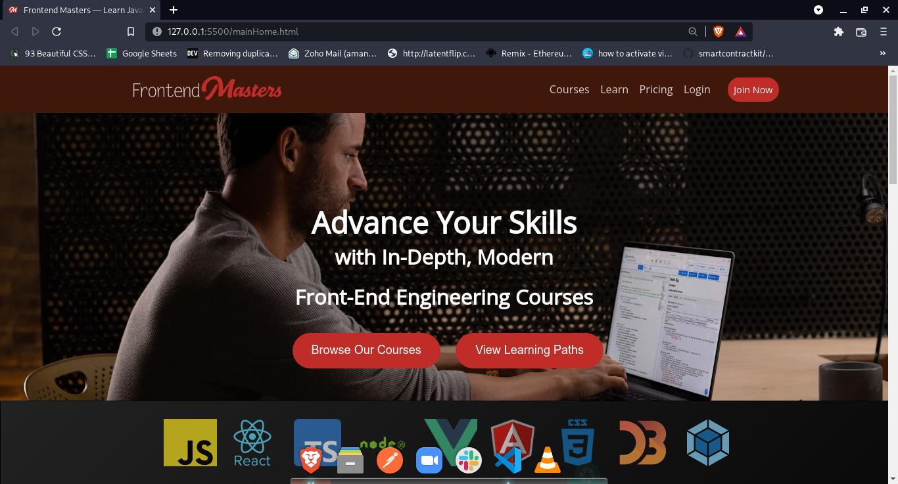

<h1>Front End Masters Clone</h1>

<h3>We have cloned the Front End Masters Website <a href="https://frontendmasters.com/" target="_blank">https://frontendmasters.com/</a> . Its a learning platform which mainly focuses on frontend parts - hence the name frontendmasters. It is suitable for people who are new to front end development or who want to polish their front end skills. </h3>

<h2>Stack and Libraries Used</h2>
<ul>
  <li>HTML</li>
  <li>Javascript</li>
  <li>Css</li>
  <li>jQuery (Carousel)</li>
  <li>Flickity (Carousel)</li>
</ul>

  

<h2>Sneak Peeks</h2>

Landing Page

Courses Page

Prices/Signup Page

Teachers Page

 
<h2>Team Members and Contributors</h2>
 
 

<h3>Aman Kumar</h3>
<ul>
  <li>Github: <a href= "https://github.com/isharaman8" >isharaman8</a></li>
  <li>Email: jacobreynolds4207@gmail.com</li>
  <li>LinkedIn: <a href="https://www.linkedin.com/in/aman-kumar-71b655158/"> https://www.linkedin.com/in/aman-kumar-71b655158/</a></li>
</ul>

 

<h3>Jishan Pathan</h3>
<ul>
  <li>Github: <a href= "https://github.com/jishanpatel7" >jishanpatel7</a></li>
  <li>Email:    </li>
  <li>LinkedIn: <a href="https://www.linkedin.com/in/jishan-pathan-5b398b198/">https://www.linkedin.com/in/jishan-pathan-5b398b198/ </a></li>
</ul>

 

<h3>Aakash Upadhyay</h3>
<ul>
  <li>Github: Rohanverma4</li>
  <li>Email: </li>
  <li>LinkedIn: <a href="https://www.linkedin.com/in/aakash-upadhyay-316215210/"> https://www.linkedin.com/in/aakash-upadhyay-316215210/</a></li>
</ul>

 

<h3>Nikhil Shakya</h3>
<ul>
  <li>Github:  <a href= "https://github.com/devmanush-forEach" >devmanush-forEach</a></li>
  <li>Email: </li>
  <li>LinkedIn: </li>
</ul>

 

<h3>Mahesh</h3>
<ul>
  <li>Github: </li>
  <li>Github Link: </li>
  <li>Email: </li>
  <li>LinkedIn: </li>
</ul>
